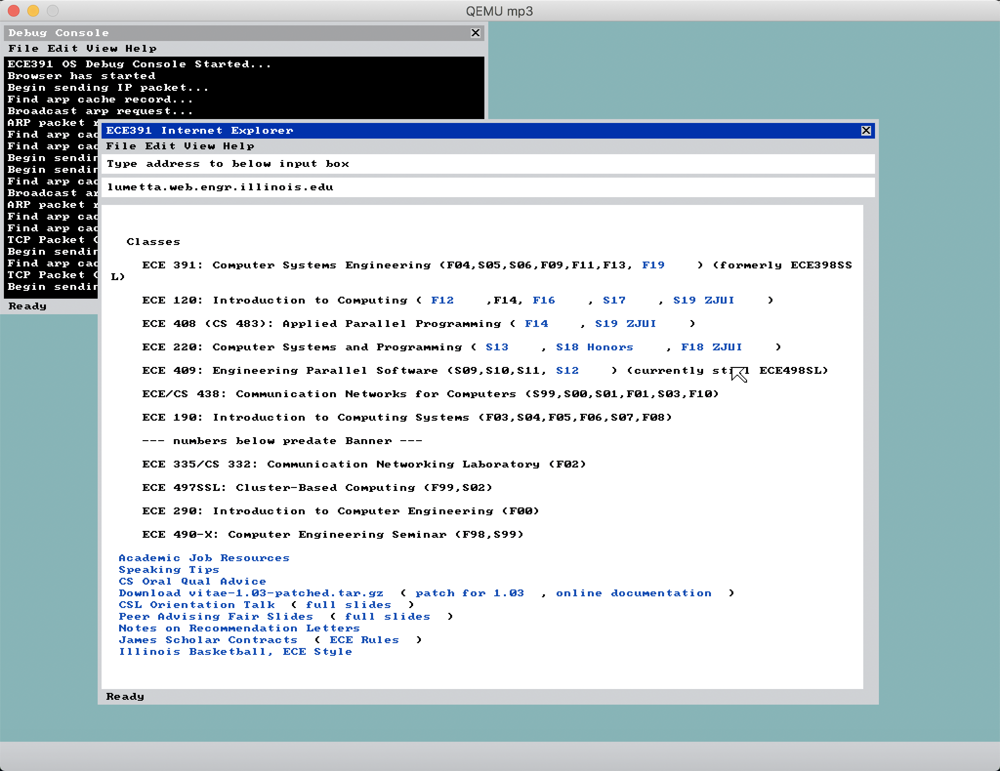

# WeirdOS
> WeirdOS = A really Weird Operating System

WeiredOS is a [Linux](https://en.wikipedia.org/wiki/Linux) like operating system under [x86-32](https://en.wikipedia.org/wiki/IA-32) instruction set, which is derived from final project of [ECE391](https://ece.illinois.edu/academics/courses/profile/ECE391)@UIUC.

## Preview

*The browser is showing Prof Lumetta's [website](http://lumetta.web.engr.illinois.edu/)*

## Tech Spec
We use the following techs during development of WeirdOS:
- C
- x86-32
- QEMU

## Features
We implement the following techs in WeirdOS:
### Basic
- GDT/IDT Support
- [i8259](https://en.wikipedia.org/wiki/Intel_8259) PIC Interrupt Handler
- Memory Paging
- Terminal Driver (VGA Driver under [Text Mode](http://en.wikipedia.org/wiki/Text_mode))
- Real-Time Clock Driver and Virtualization
- Basic Set of System Calls
- Keyboard Driver and Input Buffer
- Read-only Filesystem
- Exception/Trap Handler
- Task Abstraction and Process Control Block
- User Mode and Stack Switching
- User-level Code Loader
- Programmable Interrupt Timer Deiver
- Inter-process Context Switching
- Round-robin Style Shceduling

## Extra
- Dynamic Memory Allocation (`kmalloc` and `kfree` support)
- VESA High Resolution Support
- PS/2 Mouse Driver
- [PCI](https://en.wikipedia.org/wiki/Conventional_PCI)(Peripheral Component Interconnect) Driver
- Graphical User Interface(GUI)
  - [DOM](https://en.wikipedia.org/wiki/Document_Object_Model) Tree Based Render
  - Responsive Layout
  - Windows Drag & Drop
  - Scroll View
  - Intelligent Lazy Render
- Networking
  - [RTL8139](https://en.wikipedia.org/wiki/RTL8139) Driver
  - Link Layer: Ethernet
  - Network Layer: ARP(Address Resolution Protocol), IPv4(Internet Protocol version 4)
  - Transport Layer: UDP(User Datagram Protocol), TCP(Transmission Control Protocol)
  - Application Layer: DNS(Domain Name System), HTTP(HyperText Transfer Protocol)(Chunk Support)
  - Socket Abstraction and Port Management
- Browser!
  - HTML Parser and HTML2DOM Tree Generator
  - Keyboard and Mouse Event Handler
  - HTTP API

## Starting Guide
### Build Image
```shell
cd ./student-distrib
# build dependencies
make dep
# build the OS (it is called bootimg) and the QEMU disk image (mp3.img)
make
```

### Testing in VM
Make sure you are at host machine and the root path of mp3(not `student-distrib`).
```shell
# test_nodebug
make vm
# test_debug
make vmdebug
```

## Memory Layout
Seems for Qumu on my local machine(MacOS), the physical memory start from `693KB` to `260992KB` (under memory of `256MB`), the `693KB` is like `0x9fc00`, so we may not use memory below that.
```
---------------------------------------------------------
0-4MB Kernel Memory(V=P)
Terminal Unshown Video Memory 0x200000(2MB) + tid * 4KB
Video Memory VGA 0xA0000-0xBF000
---------------------------------------------------------
4MB-8MB Kernel Memory(V=P)
PCB 8KB each
Task Kernel Stack
---------------------------------------------------------
8MB+ User Memory(V: 128MB=0x08000000, P:)
4MB each Task User Stack
User Video Memory 0x9000000
VBE 0xFD000000 4GB (V=P)
---------------------------------------------------------
Dynamic Allocated Area
```

## External Library
- HTML Parser credit to [html](https://github.com/h4xxel/html)
- URL Parser credit to [libyuarel](https://github.com/jacketizer/libyuarel)

## Logistics
- Checkpoint 1 due Monday 10/21/2019, 6pm in GitLab
- Checkpoint 2 due Monday 10/28/2019, 6pm in GitLab
- Checkpoint 3 due Monday 11/11/2019, 6pm in GitLab
- Checkpoint 4 due Monday 11/18/2019, 6pm in GitLab
- Checkpoint 5 due Sunday 12/8/2019, 11:59pm in GitLab

## Package contents
```
createfs
    This program takes a flat source directory (i.e. no subdirectories
    in the source directory) and creates a filesystem image in the
    format specified for this MP.  Run it with no parameters to see
    usage.

elfconvert
    This program takes a 32-bit ELF (Executable and Linking Format) file
    - the standard executable type on Linux - and converts it to the
    executable format specified for this MP.  The output filename is
    <exename>.converted.

fish/
	This directory contains the source for the fish animation program.
	It can be compiled two ways - one for your operating system, and one
	for Linux using an emulation layer.  The Makefile is currently set
	up to build "fish" for your operating system using the elfconvert
	utility described above.  If you want to build a Linux version, do
	"make fish_emulated".  You can then run fish_emulated as superuser
	at a standard Linux console, and you should see the fish animation.

fsdir/
	This is the directory from which your filesystem image was created.
	It contains versions of cat, fish, grep, hello, ls, and shell, as
	well as the frame0.txt and frame1.txt files that fish needs to run.
	If you want to change files in your OS's filesystem, modify this
	directory and then run the "createfs" utility on it to create a new
	filesystem image.

README
    This file.

student-distrib/
    This is the directory that contains the source code for your
    operating system.  Currently, a skeleton is provided that will build
    and boot you into protected mode, printing out various boot
    parameters.  Read the INSTALL file in that directory for
    instructions on how to set up the bootloader to boot this OS.

syscalls/
    This directory contains a basic system call library that is used by
    the utility programs such as cat, grep, ls, etc.  The library
    provides a C interface to the system calls, much like the C library
    (libc) provides on a real Linux/Unix system.  A few support
    functions have also been written (things like strlen, strcpy, etc.)
    that are used by the utility programs.  The Makefile is set up to
	build these programs for your OS.
```